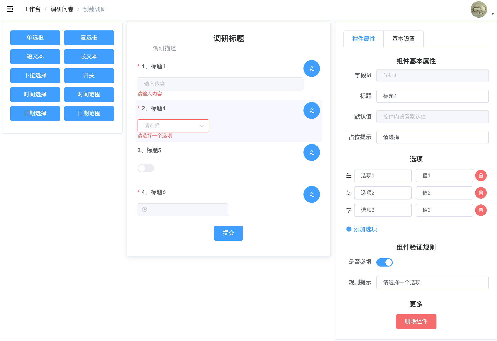
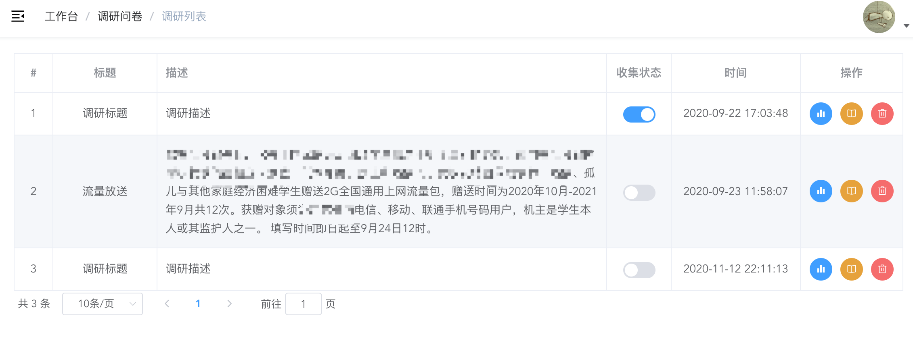
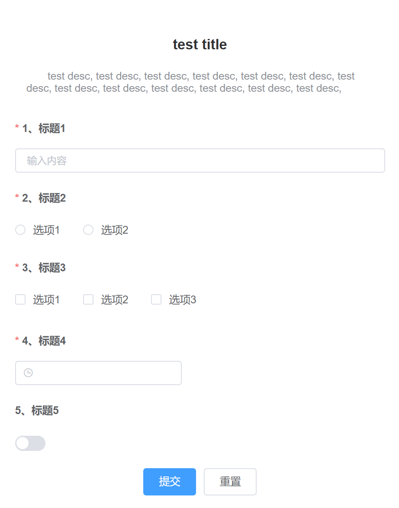

# vue-research-admin

## About The Project

> Dynamic form, survey questionnaire frontend system. Back-end repo: 

-   [x] Create custom research
-   [x] Update research info
-   [x] Download research data
-   [x] Delete research







### Built With

-   [vue](https://vuejs.org/)
-   [vue-admin-template](https://github.com/PanJiaChen/vue-admin-template)

## Related Project

-   [research_sys](https://github.com/Pandalzy/research_sys)

## Getting Started

### Installation

1. clone the project

```sh
git clone https://github.com/Pandalzy/vue-research-admin.git
```

2. enter the project directory

```sh
cd vue-research-admin
```

3. install dependency

```sh
npm install
```

### Configuration

Edit `src/util/request.js` file and modify base api.

```python
baseURL: "http://127.0.0.1:8000/api/"
```

### Run

```sh
npm run serve
```

## License

Distributed under the MIT License. See `LICENSE` for more information.
