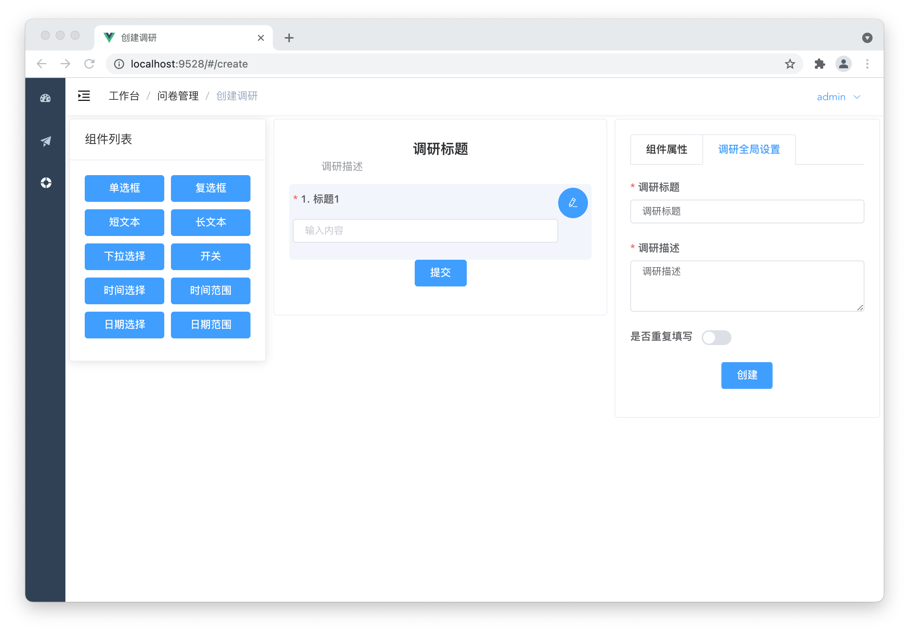
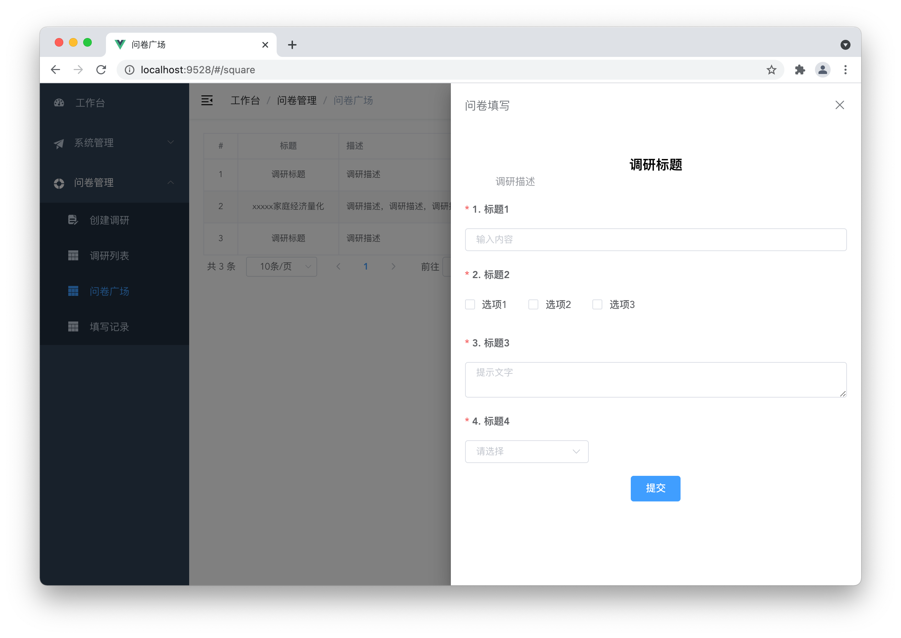
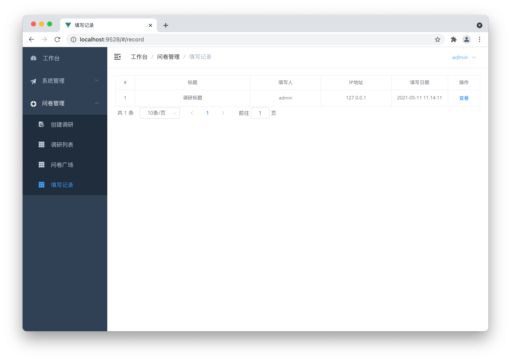

# vue-research-admin

## About The Project

> Dynamic form, survey questionnaire frontend system. Back-end repo: [gin-research-sys](https://github.com/Pandalzy/gin-research-sys)

### Work list

-   [x] RBAC user manage
    -   [x] User
        -   [x] Create user and set password
        -   [x] Set the role and update
        -   [x] Reset Password
        -   [ ] Import the user
    -   [x] Role
        -   [x] Set the permission and update
    -   [x] Permission
        -   [x] Sorting and grouping
-   [x] Research create
    -   [x] Create custom research
    -   [x] Field validation
-   [x] Research list
    -   [x] Update and preview
    -   [x] Download record data
-   [x] Research square
    -   [x] Preview and wirte
    -   [ ] Research data analysis
    -   [ ] Research data view
-   [x] Record list
    -   [x] Simple wirter info
    -   [ ] Research data analysis
    -   [ ] Research data view
-   [ ] More
    -   [ ] Logs manage
    -   [ ] Online users
    -   [ ] Task queue

### RBAC manage


### Research manage







### Built With

-   [vue](https://vuejs.org/)
-   [vue-admin-template](https://github.com/PanJiaChen/vue-admin-template)


## Getting Started

### Installation

1. clone the project

```sh
git clone https://github.com/Pandalzy/vue-research-admin.git
```

2. enter the project directory

```sh
cd vue-research-admin
```

3. install dependency

```sh
npm install
```

### Configuration

Edit `src/util/request.js` file and modify base api.

```python
baseURL: "http://127.0.0.1:8080/api/"
```

### Run

```sh
npm run serve
```

## License

Distributed under the MIT License. See `LICENSE` for more information.