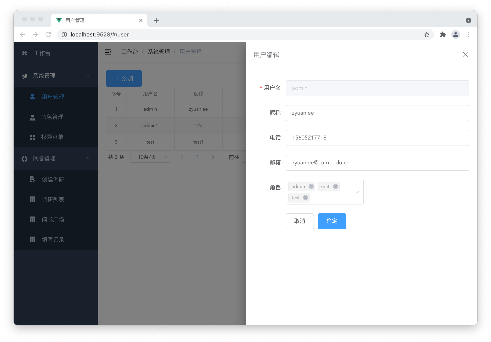
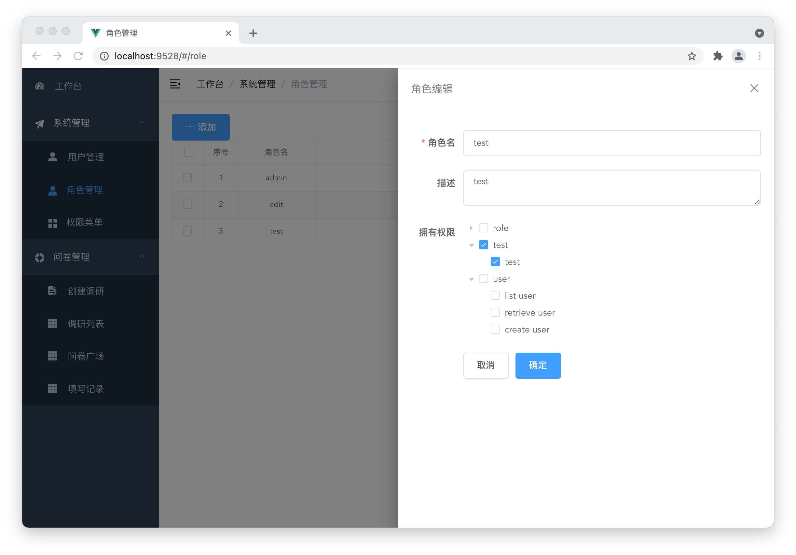
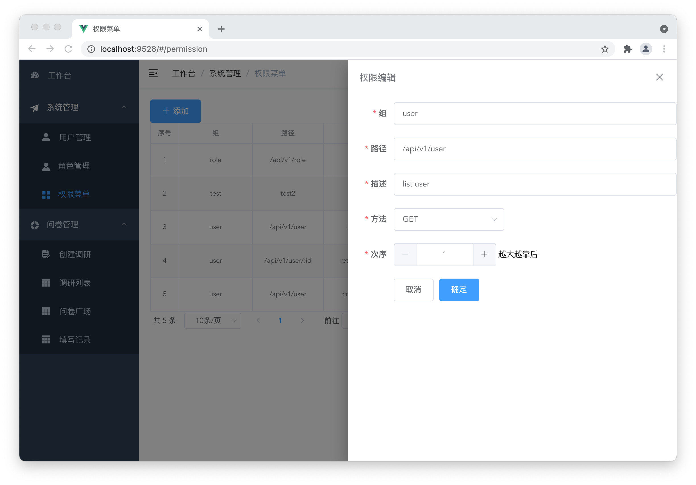
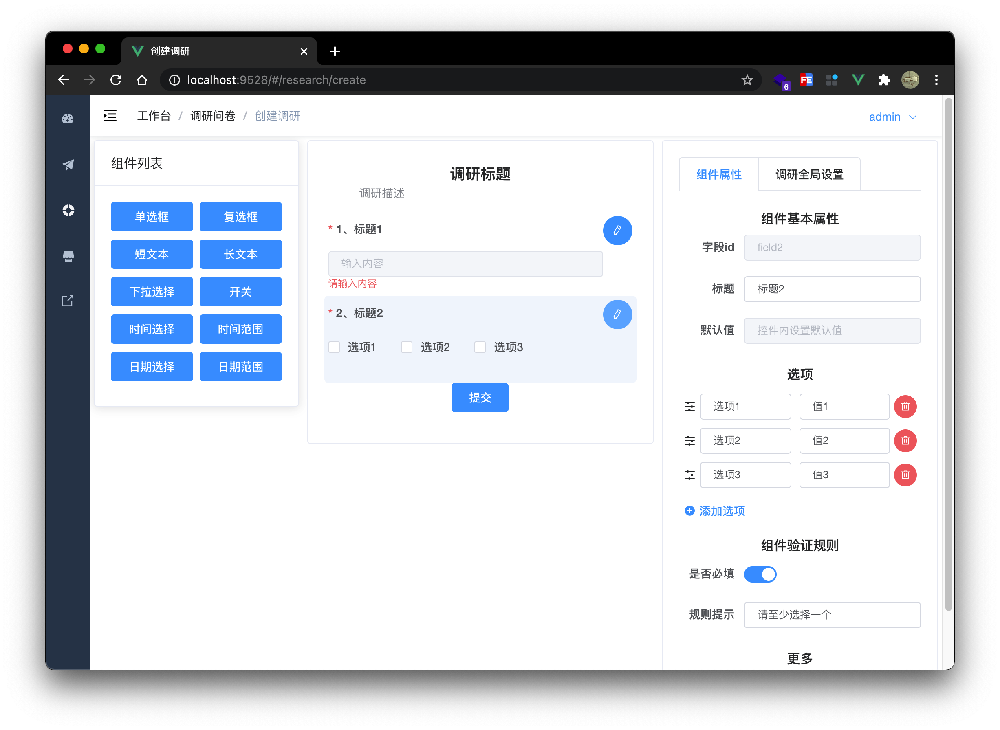
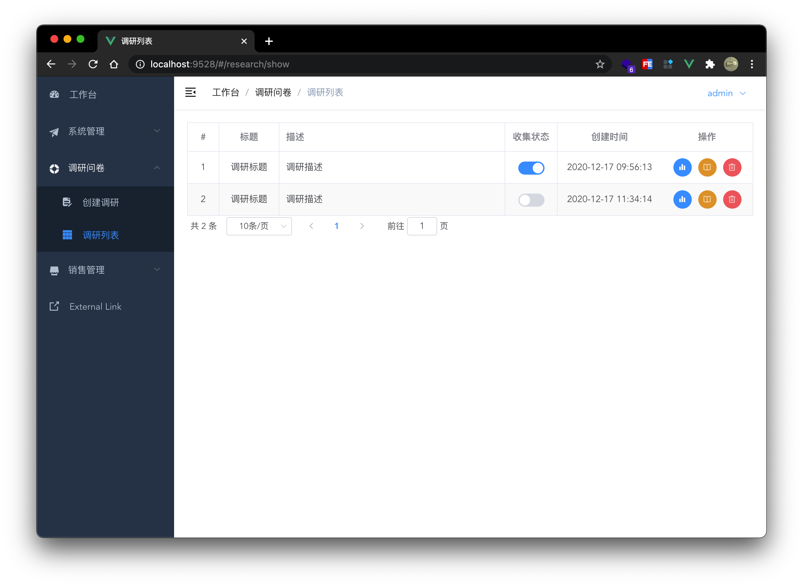

# vue-research-admin

## About The Project

> Dynamic form, survey questionnaire frontend system. Back-end repo: [gin-research-sys](https://github.com/Pandalzy/gin-research-sys)

### Work list

> The new version is not finished

-   [x] RBAC user manage
    -   [x] CURD user, role, permission
    -   [x] User avatar update
    -   [x] Simple password modification
    -   [x] Authorized routing and menu
    -   [ ] Custom user reset password
    -   [ ] Customize the password for adding users
-   [x] Research manage
    -   [x] Create custom research
    -   [x] Update research info
    -   [x] Download research data
    -   [x] Delete research
    -   [ ] Research data analysis
    -   [ ] Research data view
    -   [ ] Limit the number of fills
-   [ ] Logs manage
-   [ ] More

### RBAC manage







### Research manage





### Built With

-   [vue](https://vuejs.org/)
-   [vue-admin-template](https://github.com/PanJiaChen/vue-admin-template)


## Getting Started

### Installation

1. clone the project

```sh
git clone https://github.com/Pandalzy/vue-research-admin.git
```

2. enter the project directory

```sh
cd vue-research-admin
```

3. install dependency

```sh
npm install
```

### Configuration

Edit `src/util/request.js` file and modify base api.

```python
baseURL: "http://127.0.0.1:8080/api/"
```

### Run

```sh
npm run serve
```

## License

Distributed under the MIT License. See `LICENSE` for more information.